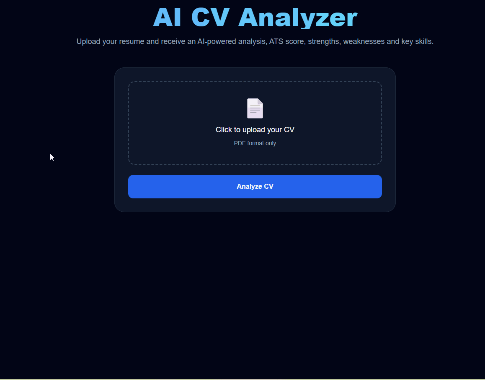
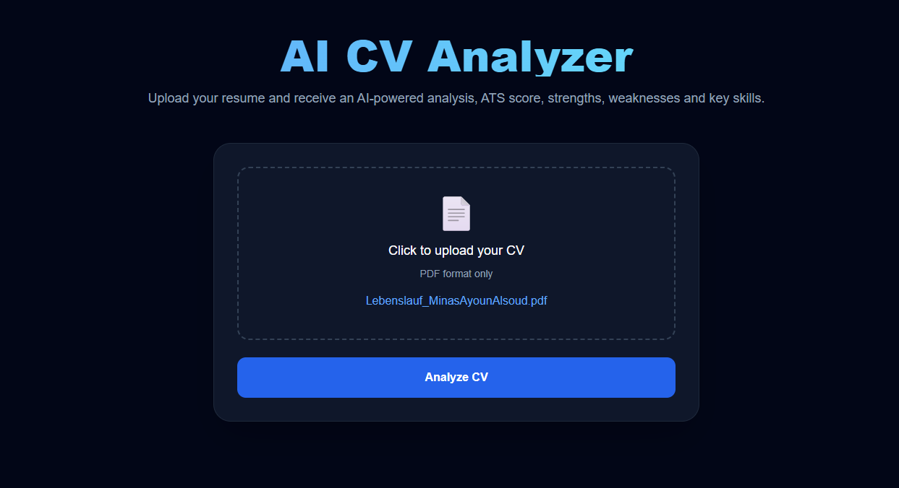

# 🚀 AI CV Analyzer

A full-stack AI-powered CV analysis tool that evaluates resumes using OpenAI.

---

## 📸 Demo



---

## ✨ Features

- Upload PDF CV
- AI-powered skill extraction
- ATS Score calculation
- Education & Projects detection
- Modern React UI (TailwindCSS)

---

## 🛠️ Tech Stack

- React (Vite)
- TailwindCSS
- Flask (Python)
- OpenAI API
- MongoDB Atlas

---

## 📷 Screenshots

### Home Page



---

## ⚙️ How to Run

### Backend

```bash
cd backend
python app.py
```

### Frontend

```bash
cd frontend
npm install
npm run dev
```
